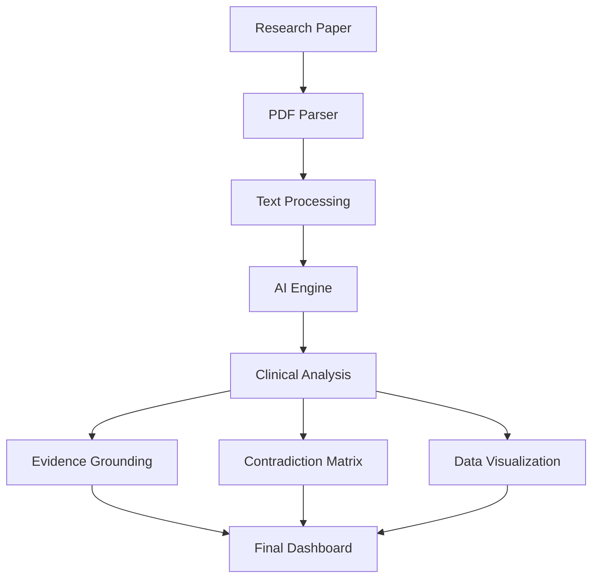

# git-learning
First Github Repo By ~
 Mayank Mishra
## System Architecture

```mermaid
flowchart TD
    A[Research Paper] --> B[PDF Parser]
    B --> C[Text Processing]
    C --> D[AI Engine]
    D --> E[Clinical Analysis]
    E --> F[Evidence Grounding]
    E --> G[Contradiction Matrix]
    E --> H[Data Visualization]
    F --> I[Final Dashboard]
    G --> I
    H --> I
```
